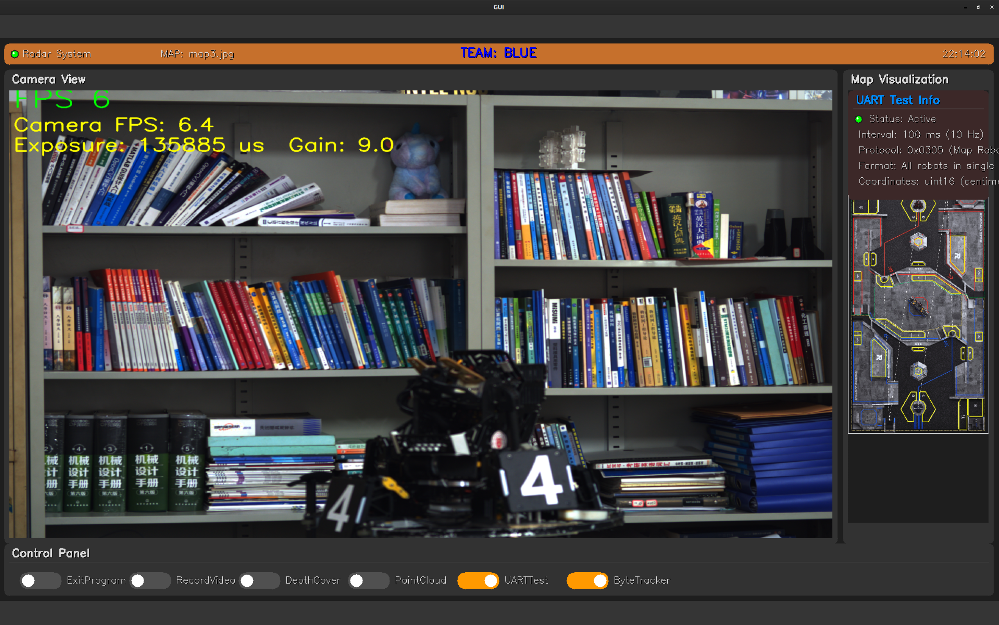
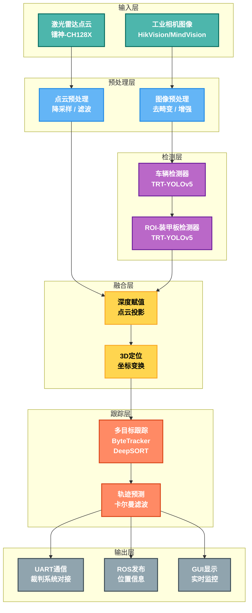
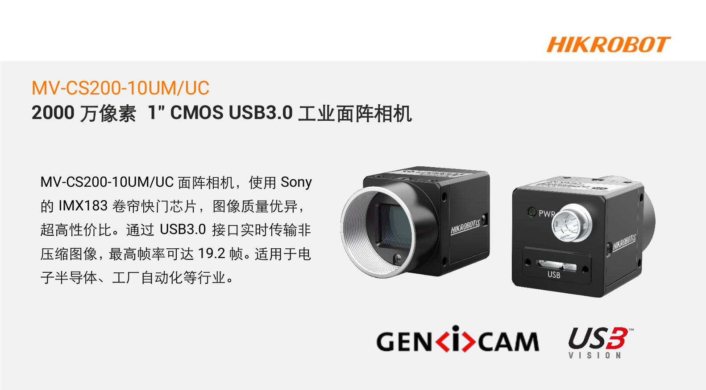
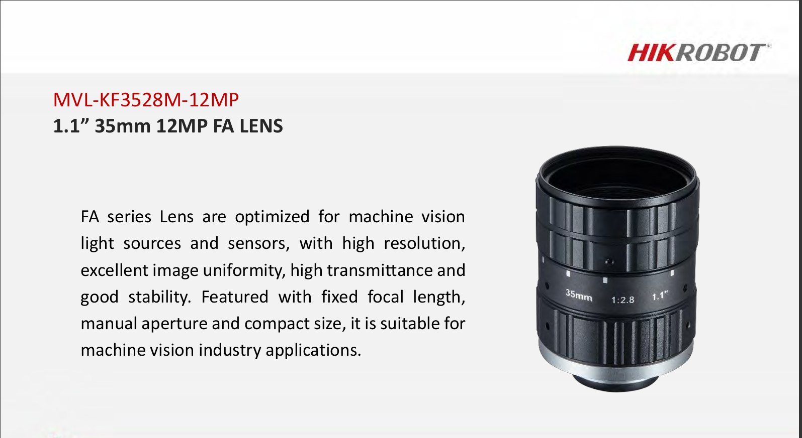
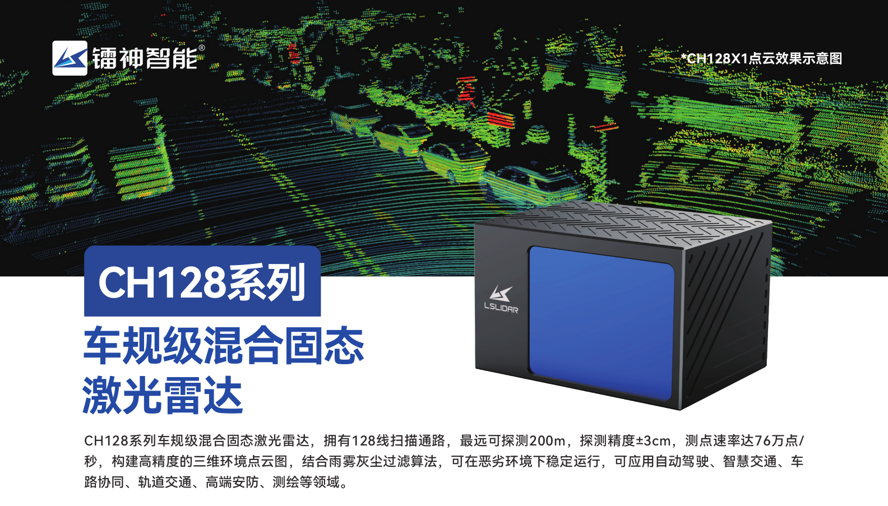
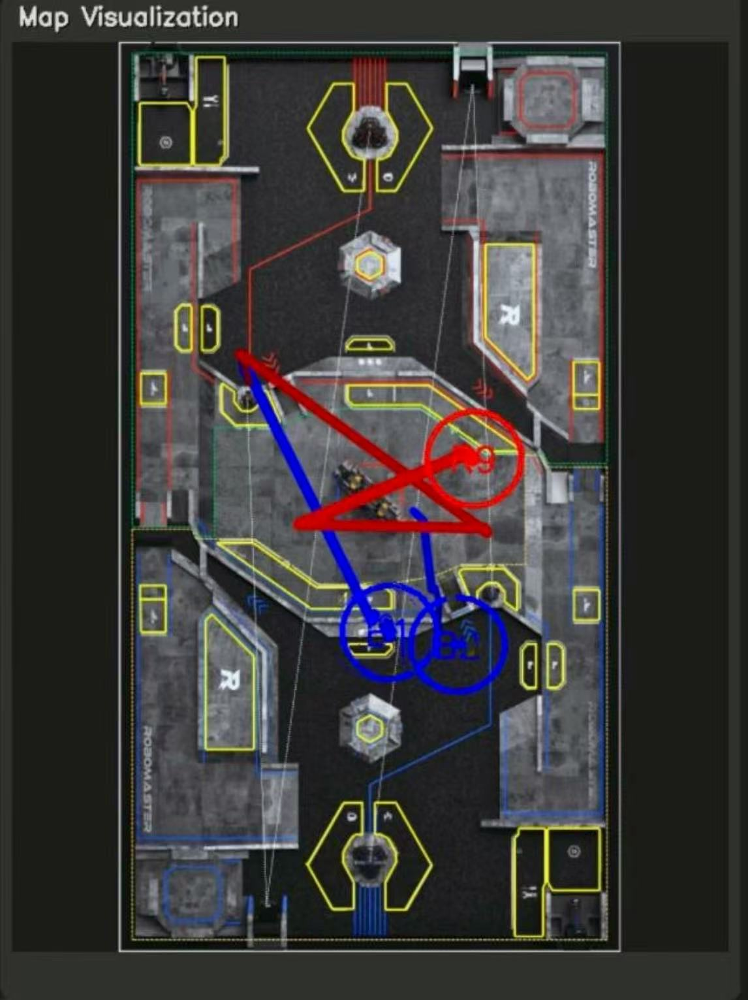
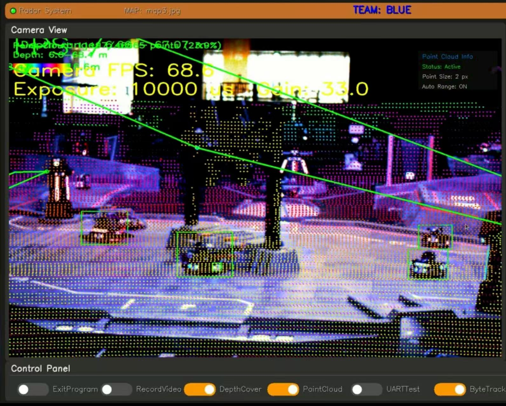
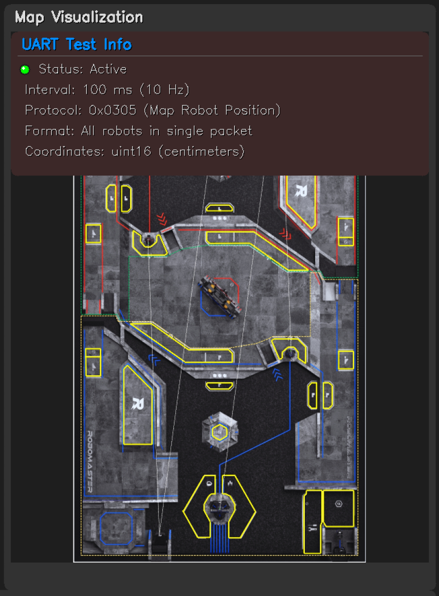

<div align="center">
	
</div>

<h2 align="center">ROBOMASTER-2025 · 华北理工大学HORIZON战队 · LiDAR-2025</h2>

---

<div align="center">
  <a href="LICENSE"></a>
  <a href="http://wiki.ros.org/noetic"></a>
  <a href="https://developer.nvidia.com/cuda-toolkit"></a>
  <a href="https://developer.nvidia.com/tensorrt"></a>
  <a href="https://opencv.org/"></a>
  <a href="https://pointclouds.org/"></a>
  
  
</div>

<div align="center">
  <p>
    <a href="#overview">项目概述</a> •
    <a href="#demo">系统演示</a> •
    <a href="#pipeline">系统架构</a> •
    <a href="#quickstart">快速开始</a> •
    <a href="#hardware">硬件介绍</a> •
    <a href="#license">许可证</a> •
    <a href="#contact">联系与支持</a>
  </p>
</div>

---

## 📖 项目概述

​	**LiDAR-2025** 是 **华北理工大学 HORIZON 战队** ROBOMASTER-2025 赛季 **雷达站** 方案。

​	系统融合 **激光雷达点云** 与 **工业相机视觉**，实现对赛场机器人的 **实时检测、跟踪与定位**。

​	该方案是对 [沈阳航空航天大学T-UP战队2023赛季雷达程序](https://github.com/tup-robomaster/RM_Radar2023) 的 **重构与针对性优化和创新**。

​	在 **高密度点云高速处理**，**跟踪 ID 持久化**，**多传感器适配** 以及**扩展性**等多方面进行了重构。

---

##  系统演示——实际运行效果

<p align="center">
  <br>
  <b>录制于 ROBOMASTER-2025 - 南部赛区 - 北京理工大学(珠海) - MindVision</b>
</p>


<p align="center">
  <br>
  <b>HikVision 工业相机以及UART通信测试模块运行雷达站效果</b>
</p>

**[Bilibili效果展示视频](https://www.bilibili.com/video/BV1AWtgzREbX/?spm_id_from=333.337.search-card.all.click&vd_source=3c76eab145811dc6a99e9691ce7f2384)**

**Tips :**

​	**说明： 效果展示视频之所以卡顿是因为该视频在录制中由于设备负载较大被异常终止导致视频损坏，当时没能及时发现该问题，后续整理相关材料才发现视频损坏。尽管后续进行了一系列人为视频修复工作，但是效果仍然不佳，大量片段损坏、丢失或马赛克现象严重，所以只能对视频有效部分进行剪辑。**

​	**实际运行效果流畅，使用MindVision工业相机整体帧率在60帧左右，HikVision工业相机由于分辨率极高，整体帧率在10帧左右**。

---

## 系统架构——核心处理流水线




</div>

---

## 硬件介绍

### 个人运算端配置
- **CPU**：Intel i9-12700H  
- **GPU**：NVIDIA RTX 3060  

### 支持的硬件设备

#### 工业相机
- 海康威视 (Hikvision) MV-CA 系列  
- 迈德威视 (Mindvision) MV 系列  
- **分辨率**：≥1280×1280  
- **接口**：USB3.0 / GigE  

<table>
  <tr>
    <td align="center">
      <br>
    </td>
    <td align="center">
      <br>
    </td>
  </tr>
</table>


#### 激光雷达

- 镭神-**CH128X**（主要测试设备）  
- Livox Avia（兼容）  
- Livox Mid-360
- Livox Mid-70
- Livox Mid-40
- Livox HAP
- Livox Horizon
- Velodyne HDL-64E 
- Unitree 4D LiDAR L1
- Ouster OS1-128

<p align="center">
  <br>
  <sub><i>镭神 CH128X1 激光雷达</i></sub>
</p>

---

## 🚀 快速开始

> **重要**: 在启动程序前，必须完成以下配置步骤

---

## 1️⃣ 环境准备

1. 系统：推荐 **Ubuntu 20.04 LTS**。
2. 必要依赖：

   * GCC ≥9.3
   * CUDA（11.6 或更高）、cuDNN （8.6.0+）、TensorRT（≥8.5）
   * ROS-noetic、PLC 1.10.0+、OpenCV 4.6、PCL 1.10、spdlog 1.8+、Eigen3 3.3、MKL
3. 驱动：安装 **Livox 雷达驱动**、**迈德威视相机驱动**、**海康威视相机驱动**
4. 配置参数：**相机标定参数与激光雷达与相机联合标定参数**——[src/radar2025/params/camera0.SJTU.yaml](src/radar2025/params/camera0.SJTU.yaml)
5. 话题配置：激光雷达**点云话题**接入——[src/radar2025/config.h](src/radar2025/config.h)
6. 硬件建议：GPU 显存 ≥6GB，内存 ≥16GB。

---

## 2️⃣ 项目获取与编译

1. clone 仓库（一定要带 `--recursive`）：

   ```bash
   git clone https://github.com/BreCaspian/ROBOMASTER-HORIZON-LiDAR-2025.git
   ```
2. 准备资源目录：

   * `models`：[YOLOv5 v6.0 导出的动态 onnx（车辆模型+装甲板模型）](https://github.com/tup-robomaster/RM_Radar2023/releases)。
   * `params`：相机内参、外参标定文件——[camera0.SJTU.yaml](src/radar2025/params/camera0.SJTU.yaml)。
   * `resources`：[上海交通大学-测试视频](https://github.com/tup-robomaster/RM_Radar2023/releases)。
3. 修改 `src/radar2023/CMakeLists.txt`，设置合适的 `CUDA_GEN_CODE` 对应显卡算力。

<div align="center">

|         GPU系列          | 架构代号 | 计算能力 |           CMake配置            |
| :----------------------: | :------: | :------: | :----------------------------: |
|      **GTX 10系列**      |  Pascal  |   6.1    |  `arch=compute_61,code=sm_61`  |
|   **Quadro P/Tesla P**   |  Pascal  |   6.0    |  `arch=compute_60,code=sm_60`  |
|      **Jetson TX2**      |  Pascal  |   6.2    |  `arch=compute_62,code=sm_62`  |
| **Tesla V100 / Titan V** |  Volta   |   7.0    |  `arch=compute_70,code=sm_70`  |
|  **Jetson Xavier / NX**  |  Volta   |   7.2    |  `arch=compute_72,code=sm_72`  |
|      **GTX 16系列**      |  Turing  |   7.5    |  `arch=compute_75,code=sm_75`  |
|      **RTX 20系列**      |  Turing  |   7.5    |  `arch=compute_75,code=sm_75`  |
|         **A100**         |  Ampere  |   8.0    |  `arch=compute_80,code=sm_80`  |
|      **RTX 30系列**      |  Ampere  |   8.6    |  `arch=compute_86,code=sm_86`  |
|     **Jetson Orin**      |  Ampere  |   8.7    |  `arch=compute_87,code=sm_87`  |
|      **RTX 40系列**      | Lovelace |   8.9    |  `arch=compute_89,code=sm_89`  |
|         **H100**         |  Hopper  |   9.0    |  `arch=compute_90,code=sm_90`  |
|   **H100 (PTX 8.0+)**    |  Hopper  |   9.0a   | `arch=compute_90a,code=sm_90a` |

</div>

```cmake
# 在CMakeLists.txt第30行修改
set(CUDA_GEN_CODE "-gencode arch=compute_86,code=sm_86")  # 示例：RTX 3060
```

**编译**：

```bash
source /opt/ros/noetic/setup.sh
source ~/intel/oneapi/setvars.sh   # 若启用MKL(可选)
catkin build
```

---

## 3️⃣ 首次运行

1. 为串口与雷达驱动赋予权限（如 `sudo chmod 666 /dev/ttyUSB*`）。

2. **启动激光雷达驱动发布点云话题（以CH128X激光雷达为例）**：
   
   ```bash
   source devel/setup.bash
   roslaunch lslidar_driver lslidar_ch128x1.launch
   ```
   
3. 点云 RViz 可视化 (可选)：

   ```bash
   rviz
   ```

   设置 **`Fixed Frame`** 为：

   ```
   CH128X
   ```

   添加显示项：

   ```
   Add -> By Topic -> PointCloud2（即 /cloudpoints）
   ```

4. **启动驱动和主程序**：

   ```bash
   source devel/setup.bash
   roslaunch radar2025 radar2025.launch
   ```

5. **初次运行**会自动将 ONNX 转换为 TensorRT engine，耗时约 1–10 分钟。

---

## 4️⃣ 相机与标定

1. 进入相机预览，按 **t** 调节曝光/增益。
2. 进入 **四点标定**：依次点击地图角点，按空格继续，按 **z** 撤回。
3. 标定完成后结果会保存至 `params` 目录。

---

## 5️⃣ 使用与调试

1. 主窗口可控制退出、录像，实时显示点云可视化+ByteTrack追踪+UART测试+车辆识别结果。
2. 标定不满意时，退出并重新标定，标定完成程序即完全启动，可以看见主程序GUI，Terminal中可以看见相关日志输出
3. 支持离线点云测试：

   ​	该功能需要保证camera0.SJTU.yaml中的参数与原开源方案相同并保存测试视频于 [src/radar2025/resources](src/radar2025/resources)

   ​	详见原开源方案关于离线点云使用介绍—— [沈阳航空航天大学T-UP战队2023赛季雷达程序](https://github.com/tup-robomaster/RM_Radar2023)

---

## 6️⃣ 可选功能

* **HikVision/MindVision 相机切换**：在  `config.h` 启用 #define USE_HIKVISION_CAMERA / #define USE_MINDVISION_CAMERA ，重新编译。
* **ByteTrack 跟踪**：在主程序GUI中点击启动按钮。
* **UART 测试**：在主程序GUI中点击启动按钮。
* **点云深度图背景分割**：在 `config.h` 启用 `UsePointCloudSepTarget`，重新编译。
* **DeepSort 跟踪**：在 `config.h` 启用 `UseDeepSort`，重新编译。

---

## 顺序总结

环境配置 → clone 仓库 → 放置模型与参数 → 修改 CMake/CUDA 设置 → 编译 → 启动雷达与主程序 → 初次 Engine 转换 → 相机调节与四点标定 → 主程序运行/调试 → （可选功能启用）

---

## 📁 项目结构

```
LiDAR-2025/
├── README.md                 # 项目说明与快速启动
├── LICENSE                   # 许可证
├── CHANGELOG.md              # 更新记录
├── CODE_OF_CONDUCT.md        # 贡献规范
├── Docs/                     # 文档与图片/演示资源
└── src/
    ├── CMakeLists.txt        # 顶层 CMake
    ├── ThirdParty/           # 第三方库、SDK、源码（cv_bridge, Json, MVS, MVSDK）
    └── radar2025/            # 主程序源码（ROS 包）
        ├── CMakeLists.txt
        ├── package.xml
        ├── config.h
        ├── main.cpp
        ├── Config/           # 运行配置（default.yaml 等）
        ├── launch/           # ROS 启动文件（.launch）
        ├── msg/              # 自定义 ROS 消息 (.msg)
        ├── params/           # 相机/映射等参数文件（.yaml/.json/.txt）
        ├── models/           # AI 模型（ONNX / Pt）
        ├── resources/        # 地图、图片等资源
        ├── logs/             # 运行日志
        ├── Record/           # 录制数据目录（视频等）
        ├── GUI/              # 简单 GUI 实现（GUI.cpp）
        ├── tools/            # 辅助工具（如离线点云发布）
        └── RadarClass/       # 核心模块（按功能划分）
            ├── ByteTracker/      # ByteTrack 多目标跟踪
            ├── DsTracker/        # DeepSort 跟踪实现
            ├── TRTInference/     # TensorRT 推理（Inference）
            ├── TRTGenerator/     # TensorRT 引擎生成工具
            ├── Camera/           # 相机驱动与录像
            ├── Radar/            # 雷达主控制模块
            ├── Detectors/        # 各类检测器（Car/Armor/Movement/...）
            ├── Location/         # 3D 定位 / 地图映射
            ├── PointCloudVisualizer/ # 点云可视化
            ├── UART/             # 串口通信（裁判/测试/交互）
            ├── Logger/           # 日志系统
            └── Common/           # 公共工具与算法
```

---

## 技术介绍


## 多目标跟踪系统

### ByteTracker核心算法原理
ByteTracker作为该方案多目标跟踪的核心算法，通过级联匹配策略和运动建模实现稳定跟踪。

相较于原方案DeepSORT跟踪算法，ByteTracker采用BYTE关联策略，同时处理高分数和低分数检测框，能够有效处理遮挡情况下的目标跟踪，减少ID切换频率，提供更稳定的跟踪结果并且无需额外的特征提取网络，仅几何运算，计算开销显著降低。

- **多级关联匹配策略**：
  ByteTracker采用三层级联匹配架构，将检测结果按置信度分层处理：
  
   **第一级匹配**：优先处理高置信度检测与已确认轨迹的关联，使用匈牙利算法基于 IoU 距离进行最优匹配，确保高质量目标的稳定跟踪。
   **第二级匹配**：将未匹配的已确认轨迹与低置信度检测进行匹配，降低 IoU 阈值以提高召回率，适用于目标被部分遮挡或检测器性能波动的情况。
   **第三级匹配**：处理剩余检测与丢失轨迹的关联，基于预测位置和 IoU 相似度尝试恢复轨迹，显著减少轨迹中断现象。
  
- **卡尔曼滤波运动建模**：
  采用经典8维状态向量描述目标状态：
  
  ​	位置分量：[x, y] - 边界框中心坐标
  
  ​	形状分量：[s, r] - 边界框尺度和宽高比
  
  ​	速度分量：[dx, dy, ds, dr] - 对应的变化速度
  
  假设为匀速直线运动模型（**从后续比赛中对追踪器的分析来看，该假设合理性有待进一步考量**）；状态转移矩阵为简单的线性模型，过程噪声协方差矩阵经过额外调优。

- **预测与更新机制**：

  基于运动模型预测下一帧的目标位置并结合检测结果修正预测，预测不确定性由协方差矩阵反映。


### ID持久化与轨迹恢复机制
- **轨迹生命周期管理**：
  轨迹被分为四种状态：New、Tracked、Lost 和 Removed 。
  
  新检测需连续多帧关联才能转为稳定轨迹。
  
  丢失轨迹进入缓冲区，保留一定时间以便恢复，减少ID切换，提升跟踪连续性。
  
- **轨迹恢复策略**：
  丢失轨迹基于卡尔曼滤波预测位置，并在时间窗口内尝试与新检测关联。成功匹配的轨迹恢复原有ID，特别适用于目标因遮挡或检测失败暂时消失的场景。

- **场景自适应优化**：
  支持动态参数调节，通过参数调优测试提供多种预设模式：
  
  ​	**高召回模式**：降低检测阈值，延长轨迹保留时间，适合需捕获所有目标的场景。
  ​	**高精度模式**：提高匹配阈值，减少误关联，适合精度要求高的应用。
  ​	**快速运动模式**：调整预测权重，依赖运动模型，适应高速移动目标。
  
  
<p align="center">
  <br>
  <sub><i>ByteTrack 轨迹可视化</i></sub>
</p>


## 不同场景的 ByteTracker 配置方案

### 通过测试提供若干个可直接使用的参数配置方案

### 高召回优先配置
必须尽可能跟踪所有目标，允许一定误报  

```yaml
track_thresh: 0.3       # 降低跟踪阈值，接受更多低置信度检测
high_thresh: 0.5        # 降低高置信度阈值，更容易创建新轨迹
match_thresh: 0.6       # 降低匹配阈值，更宽松的匹配策略
use_second_match: true  # 启用二次匹配，提高召回率
restore_tracks: true    # 启用轨迹恢复，减少ID切换
track_buffer: 40        # 增大跟踪缓冲区，延长轨迹保留时间
```

------

### 高精度优先配置

要求跟踪精确性，避免误报，允许漏检

```yaml
track_thresh: 0.6        # 提高跟踪阈值，只接受高置信度检测
high_thresh: 0.75        # 提高高置信度阈值，减少新轨迹的错误创建
match_thresh: 0.8        # 提高匹配阈值，更严格的匹配策略
use_second_match: false  # 禁用二次匹配，避免误匹配
fusion_weight: 0.8       # 提高融合权重，更依赖原始检测结果
track_buffer: 20         # 减小跟踪缓冲区，更快删除不确定轨迹
```

------

### 快速移动目标配置

目标移动速度快，帧间位置变化大

```yaml
match_thresh: 0.5         # 降低匹配阈值，适应大位移
use_kalman_filter: true   # 启用卡尔曼滤波器，预测快速运动
fusion_weight: 0.6        # 降低融合权重，更依赖预测结果
track_buffer: 45          # 增大跟踪缓冲区，避免目标ID频繁变化
frame_rate: 60            # 适应更高帧率（如果硬件支持）
```

------

### 拥挤场景配置

多目标密集，容易ID混淆

```yaml
high_thresh: 0.7        # 提高高置信度阈值，减少ID混淆
match_thresh: 0.8       # 提高匹配阈值，更严格匹配策略
use_second_match: true  # 启用二次匹配，解决密集场景的关联问题
restore_tracks: true    # 启用轨迹恢复，减少ID切换
track_buffer: 35        # 适度增大跟踪缓冲区，平衡ID稳定性和准确性
```

---


## 高性能点云处理

该模块是为HORIZON战队激光雷达-CH128X 专门设计的高密度点云高速处理模块，用于大量点云高速处理，满足实时点云到深度图的转换和处理。

以 i9-12700H 为例，最高可处理百万级点云，帧率维持在 10-15 帧左右。若升级硬件可进一步提升。

### 多线程并行架构
- **负载均衡分配策略**：
  使用工作窃取调度模型，将点云数据按空间维度划分为块，最多分配16个工作线程处理独立区域 (可按需增加上限提升处理能力) 。

  将点云数据按点数均匀分割成块，每个线程处理独立的数据块，采用高效的静态负载分配策略。
  
  每个线程生成局部深度图，最终合并到全局深度图，避免线程间竞争，提高并行效率。

### 自适应算法选择
- **密度感知处理策略**：
  对于小规模点云（<50,000点），采用单线程处理，避免线程开销。

  对于大规模点云（≥50,000点），启用多线程并行处理，将数据分块分配给工作线程，确保不同数据规模下的最优性能。
  
- **内存管理优化**：
  
  使用动态内存分配替代固定大小矩阵为动态矩阵，解决大规模点云的栈溢出问题。
  
  利用Eigen库的向量化运算，实现高效的3D到2D投影变换。

### SIMD 向量化加速  ——> （启用 MKL - 已预留 SIMD 优化接口   若启用该接口预计可提升 30%- 50% ）
---


## 实时点云可视化与调试

### 3D到2D投影可视化
- **多层坐标变换**：
  从激光雷达坐标系到相机坐标系，再到图像坐标系的坐标变换。

  通过外参矩阵 E_0 进行世界坐标到相机坐标转换，内参矩阵 K_0 完成透视投影，最后通过透视除法得到像素坐标。
  
- **深度信息色彩编码**：
  使用HSV色彩空间将深度值映射为色调（近为红，远为蓝紫），增强深度信息的直观性。支持动态调整深度范围，根据点云分布优化色彩映射。

### 高性能渲染与GUI
- **简单深度处理**：
  通过维护每个像素深度值，仅更新更近的点，确保正确的前后遮挡关系，提升投影准确性。

- **固定质量渲染**：
  使用固定点大小进行点云渲染，支持开关控制。

- **现代化GUI界面**：
  事件驱动的界面支持实时参数热更新，显示FPS等基础性能指标，支持轨迹可视化。

<p align="center">
  <br>
  <sub><i>GUI 与 点云可视化</i></sub>
</p>

---


## 模块化与硬件兼容

### 相机驱动统一接口
- **抽象层设计**：
  标准化的相机操作接口封装海康威视、迈德威视的SDK调用，上层代码与硬件实现解耦，支持即插即用。
  
  通过配置文件处理不同厂商相机的参数差异。

###   固定GPU配置
- **CUDA编译配置**：
  针对RTX3060优化的固定CUDA参数，支持compute_86架构。
  
- **TensorRTU优化**：

  专门的GPU推理加速。

  

  **这里感谢沈阳航空航天大学T-UP战队2023赛季雷达程序原作者设计的[Yolov5 Tensorrt高性能推理加速模块](https://github.com/tup-robomaster/TRTInferenceForYolo/tree/cb985c57fe95e629d09e7fb03e93ff1ba99a108e)**

  这是一个非常值得大力探索的方向。

### 模块化架构
- **插件式设计**：
  各功能模块通过ROS消息解耦，支持独立开发和测试。
- **配置驱动**：
  通过编译时宏定义和运行时YAML配置控制功能开关。

---


## 测试框架

### UART通信测试
- **协议一致性验证**：
  测试框架生成符合 ROBOMASTER 0x0305 协议的测试数据包（含帧头、长度、CRC校验），验证系统响应正确性。
  
  压力测试模拟延迟、丢包等异常条件，确保高负载下的稳定性。
  
  **协议已于 ROBOMASTER 2025 超级对抗赛 前更改为最新协议**
<p align="center">
  <br>
  <b>UART 通信测试</b>
</p>

---

## 后记

* 出于后续发展规划考虑，**本方案将不再继续维护和使用**。
* 若需要启用该方案，仅需更新为最新的 UART 通信协议。

### ⚠️ 模型依赖问题

从实际赛场表现来看，本方案对检测模型质量依赖严重，现有模型已不足以满足新赛场需求。
建议使用新的方法与数据集重新训练模型，以显著提升检测性能。

### 点云处理优化方向

本方案提出的高密度点云处理思路仍具有研究价值。
推荐尝试使用 Intel TBB 进一步优化并行架构，以在保证实时性的同时降低线程调度开销。

### 激光雷达与相机联合标定

推荐使用 [direct\_visual\_lidar\_calibration](https://github.com/koide3/direct_visual_lidar_calibration) 工具：

* 方法简单高效，操作友好
* 经多次实验验证，结果准确可靠

👉 目前正在撰写基于该工具的详细联合标定教程，后续将开源完整指导材料。
      如急需使用，可与我随时联系，或参考 [官方标定教程](https://koide3.github.io/direct_visual_lidar_calibration/)

**另外提供 :**

​	**[RoboMaster-Lidar-Lab](https://github.com/BreCaspian/RoboMaster-Lidar-Lab)**

​	 **[ROBOMASTER-2025 · 华北理工大学HORIZON战队 · LiDAR ROSBAG](https://github.com/BreCaspian/ROBOMASTER-2025-LiDAR-ROSBAG)**

​	**[ROBOMASTER-2025 · 华北理工大学HORIZON战队 · 能量机关超清视频](https://github.com/BreCaspian/ROBOMASTER-2025-Energy-Mechanism-Video)**	


---

## 📄 许可证

本项目采用 **GNU General Public License v3.0 (GPL 3.0)** - 详见 [LICENSE](LICENSE) 文件。

### 📋 您的义务

- **Copyleft保护**：基于本项目的衍生作品必须使用相同许可证

- **源码公开**：分发时必须提供源代码或提供获取源码的方式

- **许可证保留**：必须保留原始许可证和版权声明

- **修改声明**：必须明确标注对原始代码的修改

---

## 🤝 致谢

- [沈阳航空航天大学T-UP战队2023赛季雷达程序](https://github.com/tup-robomaster/RM_Radar2023)

---

## 📮 联系与支持

**技术问答 / 交流  / Bug反馈 / 功能建议**

- **QQ :** 1927166841
- **Email :** yaoyuzhuo6@gmail.com  
- **Bilibili频道**：[华北理工RM创新实验室](https://space.bilibili.com/481866846?spm_id_from=333.337.search-card.all.click)

---

<p align="center">华北理工大学 HORIZON 战队 ❤️ ，为 ROBOMASTER 社区贡献力量 🚀</p>


<p align="right">
  —— 2025 年 8 月 20 日
</p>
